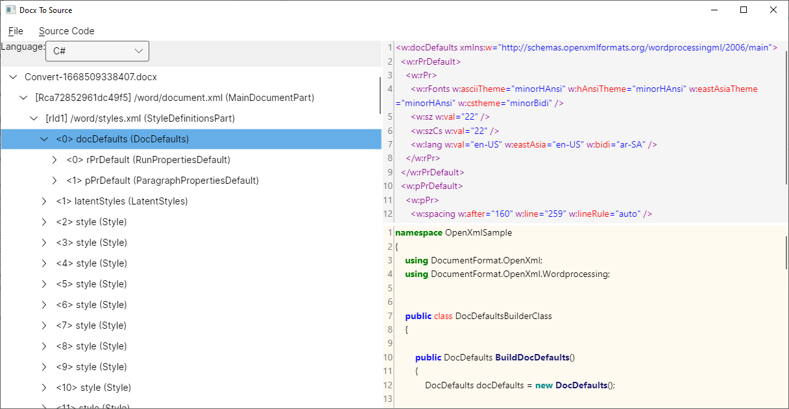

# DocxToSource.Avalonia



## About

A multi-platform application that will be able to generate dotnet source code based on OpenXml based documents. Inspired by [rmboggs/DocxToSource][docx-to-source-original] and [Avalonia][avalonia].

## How build it?

An easy way to build from source code is to use the [Git][git] and the [.NET SDK 6.0][dotnet-sdk] as follows:

```sh
$ git clone https://github.com/rstm-sf/DocxToSource.Avalonia.git && cd DocxToSource.Avalonia

$ dotnet build -c Release
$ dotnet src/DocxToSource.Avalonia/bin/Release/net6.0/DocxToSource.Avalonia.dll
```

Also, we can preliminarily change the [target framework][target-framework] in `.csproj` file to another one that [implementation supports][implementation-supports] .NET Standard 2.0


## Credits

- [rmboggs/DocxToSource][docx-to-source-original] for the original

[docx-to-source-original]: https://github.com/rmboggs/DocxToSource
[avalonia]: https://avaloniaui.net/
[git]: https://git-scm.com/downloads
[dotnet-sdk]: https://dotnet.microsoft.com/en-us/download/dotnet/6.0
[target-framework]: https://learn.microsoft.com/en-us/dotnet/standard/frameworks
[implementation-supports]: https://learn.microsoft.com/en-us/dotnet/standard/net-standard?tabs=net-standard-2-0#net-implementation-support
